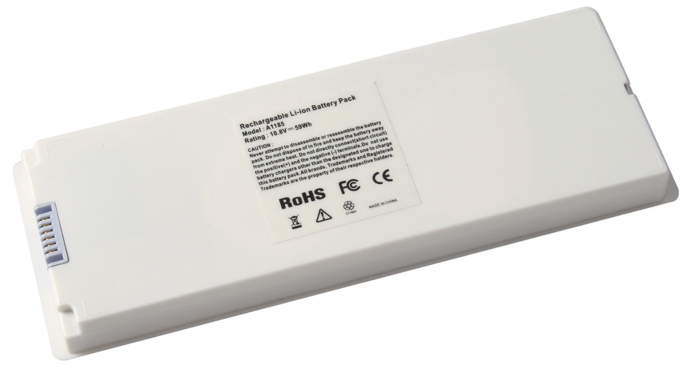
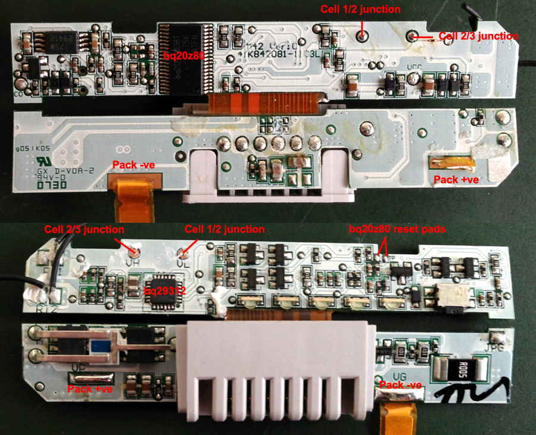
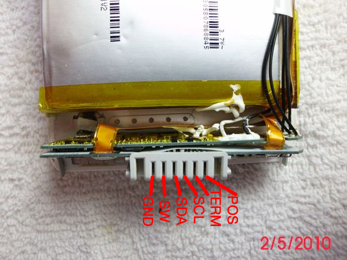
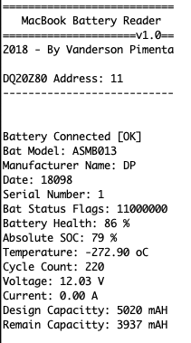
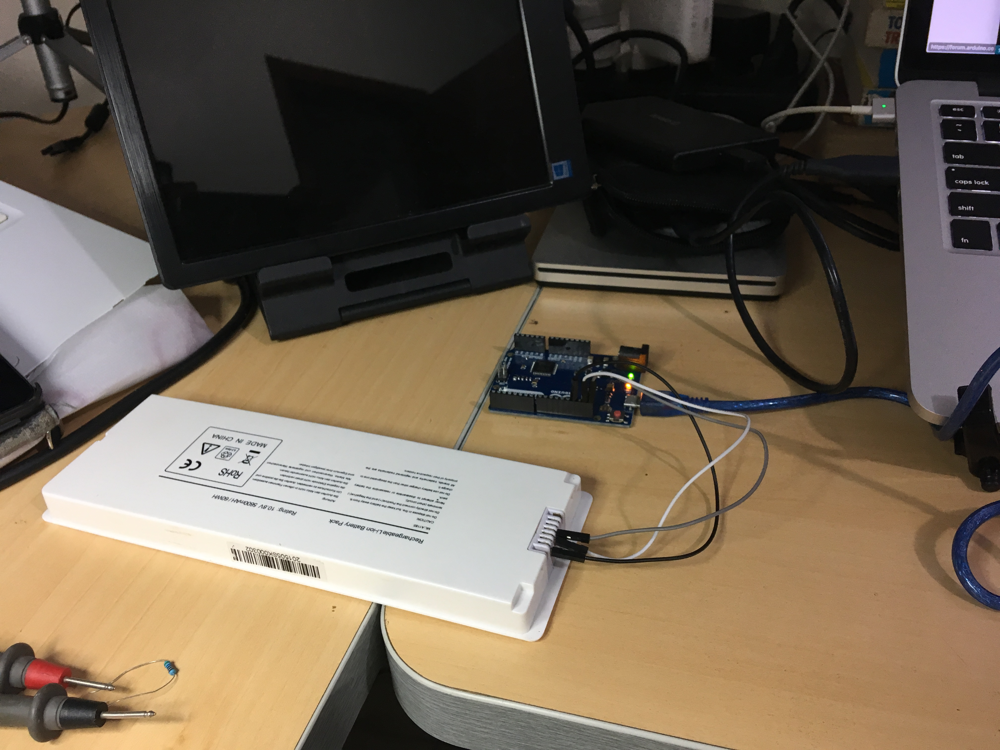
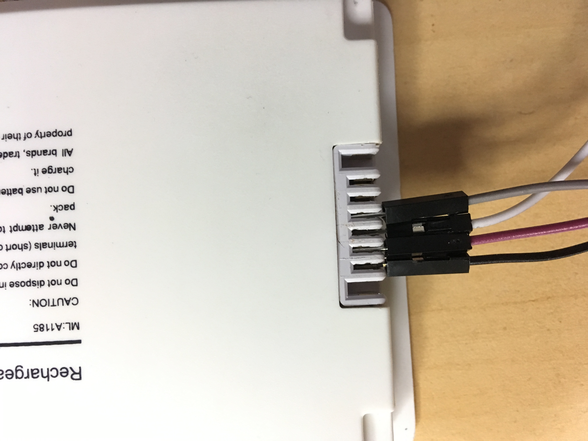
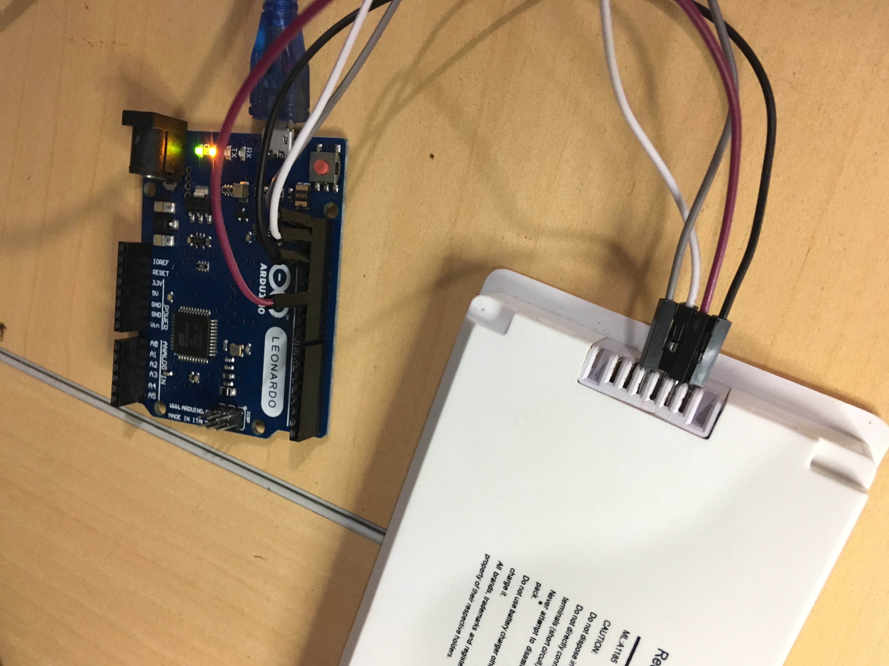

# Macbook Battery Model A1185 data read

Read the MacBook White (A1181) Internal Battery Texas Instrumens **DQ20Z80** IC using an Arduino Leonardo.

## Battery Information

## Battery Board Gutshot

## Battery Connector PinOut

 Pin       | Description          
| ------------- |:-------------:
| POS     | Positive +
| TERM    | Internal Thermistor     
| SCL     | I2C Clock      
| SDA     | I2C Data  
| SW      | Internal Switch 
| GND     | Ground  

## Battey Information Terminal Output

## Bench Setup

 Battery      | Arduino          
| ------------- |:-------------:
| POS     | NC
| TERM    | NC     
| SCL     | I2C SCL
| SDA     | I2C SDA  
| SW      | Pin 11 
| GND     | GND 

